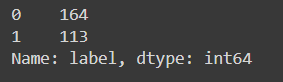
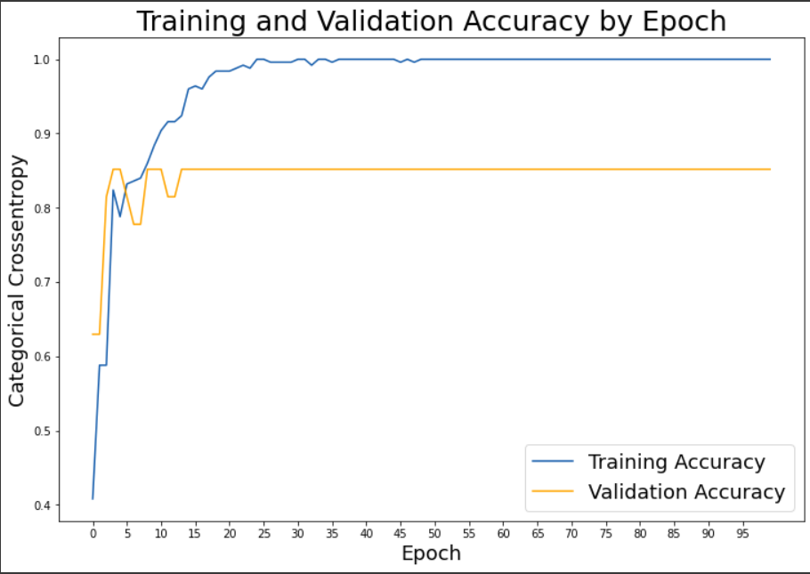
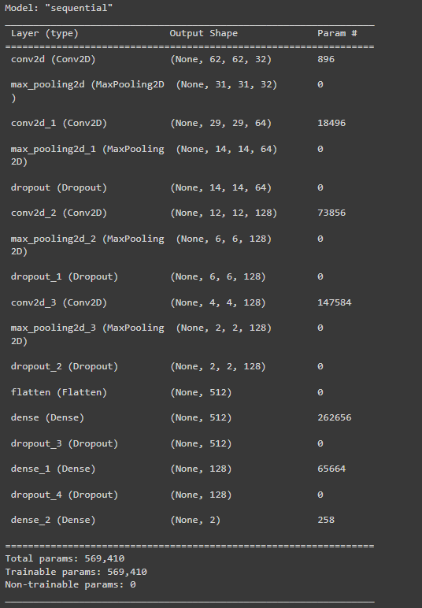
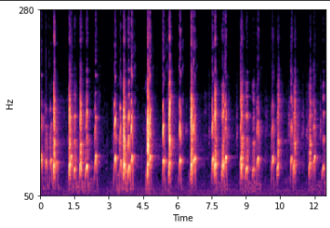
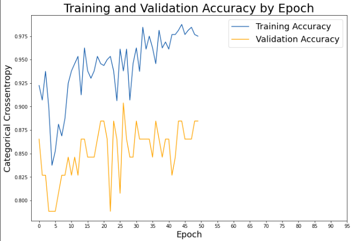

<h1 align="center" > Whoozat </h1> 

Are you a wildlife explorer with limited knowledge? Do you hear an animal but don't know what that animal is? Is it a dog? a cat? a tiger??? should you be worried? should you take precaution?? Don't worry we are here with the perfect solution for exactly this problem. Presenting to you **Whoozat** a single click application that tells you which animal you are listening to right now. 

Check out the webapp <a href="https://whoozat.azurewebsites.net/" > here </a>

<u><h2> Scope as of Now</h2></u>

The model has been trained to distinguish dog and cat voices as of now. We are still preparing the data for other animals and planning to get the new model trained as soon as possible. We have used both ANN and CNN for model development and it's upto the user to decide which one he would like to test, the CNN being the better one without doubt.

<u><h2> About the ANN Model </h2></u>

Only about 277 pieces of data points have been made available to train the model. With the limited amount of data there was trouble training the model as we were not able to acheive the required score on the validation dataset. Despite all these issues here are some of the challenges and information about the model:

<h5><b>Class Imbalance</b> </h5>
  
  

<h5><b>High Variance (Overfitting)</b> </h5>
  

<u> <h3> Link to ANN Model Training Colab Notebook </h3> </u>

<u><h2> About the CNN Model </h2></u>

The CNN model was developed using a technique that maps the audio files into an image which is then used as the input data for the CNN model. The image generated for each of the audio files is called a MelSpectogram. The generated images were then fed into the CNN model. The CNN model also suffers from the same issues as mentioned above.

<u><b>
CNN Model Architecture
</b></u>

<u><b>
MelSpectogram
</b></u>

<u><b>
Model Evaluation
</b></u>

<u> <h3> Link to CNN Model Training Colab Notebook </h3> </u>

